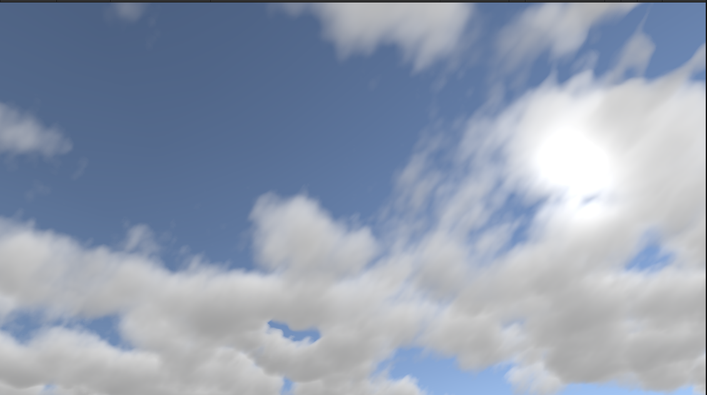

# volumetric-cloud

I started this project for my educational purpose, and I never expect this project is SO HARD to get it right. I have to admit that those people who are behind this are admirable.  I learn a lot, from searching the necessary resource to reading all the algorithms, basic theories and other's code.  It looked small from these outside, but when I started to do it, the system diverse into way many things, like 3D noise, weather system, lighting model, density model, etc... And all I got is a barely-working, scrappy version of it. There are many things that I did not implement such as temporal reprojection, downscale sampling,... and many things I did not make it right. I realize I am lack of many fundamental things before starting to implement this. Maybe PBR book is where I start to learn from scratch again, and also c++ :).

---
My weather texture generator is terrible so... just look at a part of the sky pls.
Here an image of it:

---

For the reference code, you can search it yourself :)
## Resources:
- [The-Real-time-Volumetric-Cloudscapes-of-Horizon-Zero-Dawn](https://d3d3g8mu99pzk9.cloudfront.net/AndrewSchneider/The-Real-time-Volumetric-Cloudscapes-of-Horizon-Zero-Dawn.pdf): you can read GPU Pro 7 and SIGGRAPH 2017 for more details
- [SDF cloud](https://blog.maximeheckel.com/posts/real-time-cloudscapes-with-volumetric-raymarching/)
- [Topic Discussing](https://www.gamedev.net/forums/topic/680832-horizonzero-dawn-cloud-system)
- [Article](https://www.diva-portal.org/smash/get/diva2:1223894/FULLTEXT01.pdf)
- [Volumetric Tutorial](https://www.scratchapixel.com/lessons/3d-basic-rendering/volume-rendering-for-developers/intro-volume-rendering.html)
 

